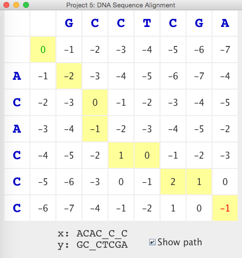

# DNA Sequence Alignment Project

Sequence Alignment is an important technique in understanding the similarity of two DNA sequences. Applications of DNA sequence alignment range from determining gene function to finding common characteristics of different species. Informally, alignment can be understood as writing the two sequences in rows, where two characters in the same column are said to be aligned. If the two aligned characters are the same, we have a match. If the two characters are different, we have a mismatch. To maximize the number of matches, we can insert gaps in either sequence. Mismatches can be interpreted as point mutations and gaps as insertion or deletion mutations. We disallow columns that consist of gaps only.

There can be many alignments of two sequences. The scores assigned to matches, mismatches, and gaps determine which are the best alignments. Unless otherwise stated, a match is scored as +2, a mismatch as -2, and a gap as -1.

An optimal solution can be found using the dynamic programming approach described in lecture. The cache constructed by the dynamic programming algorithm can be visualized as a table whose entries contain the best solution to each subproblem. The algorithm fills in the entries of the table in row-major order with the best result for every possible prefix of the alignment. More specifically, the entry at row i and column j contains the score of the best match between the first i characters of x and the first j characters of y.

The image above shows the results of aligning ACACCC with GCCTCGA. The best alignment has a score of -1, which corresponds to the entry in the lower right corner of the cache. This score is computed by summing the scores of each aligned pair of characters: -2 + 2 + -1 + 2 + -1 + 2 + -1 -2. The alignment can be written textually like this:

    ~~~~
    A C A C _ C _ C
    : | . | . | . :
    G C _ C T C G A
    ~~~~

Tasks
-----

There are some tasks for you to complete in the `Judge` class. A Judge encapsulates the costs associated with matches, mismatches, and gaps. You will need to implement a method to score two aligned characters and a method to score all characters in two aligned strings.

The `Result` class is provided for you in its entirety, but you should read the code carefully because you will need to store instances of Result in your cache. A Result is a structure that holds a solution to a subproblem. A solution consists of a score and a mutation that indicates the last choice that was made. The possible choices are M (for match), I (for insertion in x), and D (for deletion in x, or equivalently, for insertion in y). Because we ultimately wish to trace back through the path of choices, we represent the mutation with a Direction. We use DIAGONAL for M, LEFT for I, and UP for D. The mark field in a Result is used to indicate whether or not the entry appears in the optimal solution to the original alignment problem. The GUI highlights marked cells when the user selects 'Show path'.

Most of the work for this project involves implementing the TODO methods in `SequenceAligner`. Pay attention to the time bounds given in the comments. Use the Testing class to guide your development. Write some of your own tests.

The `Driver` class will launch a GUI to help you visualize the algorithm. Be sure to read the comments to see how you can modify the nucleotides in the generated sequence to see how small changes to the DNA strands affects the solution.
